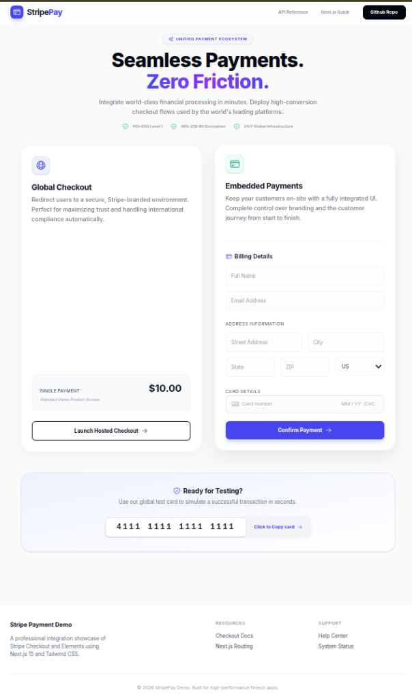

# Stripe Pay Demo 💳

A high-performance, professional integration of Stripe Checkout and Stripe Elements built with **Next.js 15**, **TypeScript**, and **Tailwind CSS**.

## Visual Preview 📸


*Professional, high-conversion checkout experience with dual integration paths.*

## Core Features 🚀

- **Dual Integration Architecture**:
  - **Global Checkout**: Seamlessly redirect users to Stripe's secure, high-conversion environment.
  - **Embedded Payments**: Keep customers on-site with a fully integrated UI using Stripe Elements.
- **Micro-Interaction Design**: Smooth transitions, loading states, and professional toast notifications (no browser alerts).
- **Clean Code & Modular Components**:
  - Extensible `Header`, `Footer`, `ProductCard`, and `CheckoutForm`.
  - Type-safe implementation using **TypeScript**.
  - Centralized Stripe client instance for backend stability.
- **Enterprise-Ready UI**: Designed with a premium aesthetic (Indigo/Emerald) and mobile-responsive layouts.
- **Secure by Design**: Sensitive card data is tokenized directly on Stripe's servers, ensuring full compliance.

---

## Getting Started 🛠️

### 1. Prerequisites

- **Node.js**: v20.x or higher
- **Stripe Account**: Access to your [Stripe Dashboard](https://dashboard.stripe.com/) for keys.

### 2. Environment Setup

Create a `.env.local` file in the root directory:

```env
STRIPE_SECRET_KEY=sk_test_...
NEXT_PUBLIC_STRIPE_PUBLISHABLE_KEY=pk_test_...
```

### 3. Installation & Run

```bash
# Install dependencies
npm install

# Run development server
npm run dev
```

The app will be available at [http://localhost:3000](http://localhost:3000).

---

## Testing Guide 🧪

Use the standard Stripe test card to simulate successful transactions:
- **Card**: `4111 1111 1111 1111`
- **Expiry**: Any future date
- **CVC**: Any 3 digits

### Integration Flow
1. **Hosted**: Click "Launch Hosted Checkout" to test Stripe's hosted page.
2. **Embedded**: Fill out the billing form and use the test card in the on-page widget.

---

## Project Structure 📁

```text
src/
├── app/          # Pages and API routes (checkout, payment-intent)
├── components/   # Modular UI components (Header, Footer, CheckoutForm, etc.)
└── lib/          # Centralized Stripe client and utilities
```

## License
MIT
